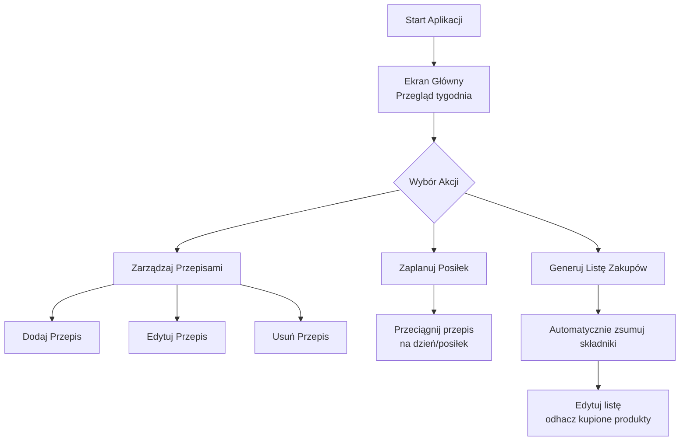

## Diagram przepływu aplikacji do planowania posiłków
Architektura interfejsu użytkownika

## Objaśnienie diagramu:
  * Start Aplikacji: Użytkownik uruchamia aplikację.
  * Ekran Główny: Wyświetla plan posiłków na bieżący tydzień.
  * Wybór Akcji: Użytkownik wybiera, co chce zrobić. Są trzy główne opcje:
    - Zarządzaj Przepisami: Przejście do bazy przepisów w celu dodania nowego, edycji lub usunięcia istniejącego.
    - Zaplanuj Posiłek: Przeciąganie i upuszczanie przepisów z bazy na konkretny dzień i posiłek (śniadanie, obiad, kolacja) w kalendarzu.
    - Generuj Listę Zakupów: Aplikacja automatycznie zbiera wszystkie składniki z zaplanowanych na dany tydzień posiłków, tworząc kompletną listę. Użytkownik może ją ręcznie edytować, odhaczając kupione produkty.
